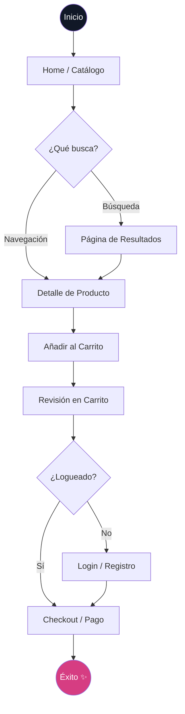

# REVISTE - Marketplace de Moda Circular 👗♻️


**REVISTE** es una plataforma premium de compra y venta de moda circular, diseñada para transformar la manera en que consumimos ropa y accesorios. Fusionamos una estética **Y2K/Glassmorphism** de vanguardia con la funcionalidad robusta de los grandes marketplaces globales, construida sobre un stack moderno de React y Tailwind CSS.

---

## ✨ Características Principales

### 📱 Arquitectura Mobile-First & Premium UI
- **Navegación Inteligente**: Sistema dual con barra superior minimalista para escritorio y **Fixed Bottom Nav** ergonómico para móviles.
- **Micro-interacciones**: Animaciones fluidas, efectos de glassmorphism y hover states dinámicos.
- **Sticky CTA**: Barra de compra persistente en móviles para agilizar la conversión.
- **Componentes CVA**: Sistema de diseño basado en átomos reutilizables con variantes controladas (Class Variance Authority).

### 🏗️ Arquitectura de "Vertical Slices"
El proyecto utiliza una estructura orientada a funcionalidades (**Feature-driven architecture**), eliminando el código espagueti y facilitando la escalabilidad:
- **Features aisladas**: Cada funcionalidad (Carrito, Catálogo, Admin) contiene sus propios componentes, hooks y lógica.
- **Layout System**: Jerarquía de layouts especializados (`MainLayout`, `AuthLayout`, `AdminLayout`) para manejar diferentes contextos de usuario.
- **Zustand State**: Gestión de estado global ligera y eficiente para el carrito de compras.

---

## 🛍️ Flujo de Compra (Customer Journey)

A continuación se describe el proceso optimizado que sigue un cliente desde el descubrimiento hasta la conversión:



## 🛠️ Stack Tecnológico

- **Core**: [React 18](https://reactjs.org/) + [Vite](https://vitejs.dev/) (Build System)
- **Lenguaje**: [TypeScript](https://www.typescriptlang.org/) (Estabilidad y tipado fuerte)
- **Estilos**: 
  - [Tailwind CSS](https://tailwindcss.com/) (Styling utilitario)
  - [CVA](https://cva.style/) (Gestión de variantes de componentes)
  - [Lucide React](https://lucide.dev/) (Iconografía dinámica)
- **Estado**: [Zustand](https://docs.pmnd.rs/zustand/getting-started/introduction) (Store reactivo)
- **Navegación**: [React Router v6](https://reactrouter.com/)

---

## 🚀 API Reference

El backend de REVISTE expone los siguientes endpoints para el manejo del catálogo y transacciones:

### Catálogo
- `GET /api/catalog/categories`: Obtiene la lista de nombres de categorías.
- `GET /api/catalog/products`: Obtiene todos los productos con sus imágenes y vendedores vinculados.
- `GET /api/catalog/products/:id`: Obtiene el detalle completo de una prenda específica.
- `POST /api/catalog/products`: Crea una nueva prenda (requiere body con detalles y URL de imagen).
- `GET /api/catalog/hero-slides`: Obtiene las diapositivas dinámicas para el carrusel de inicio.

---

## 👕 Gestión de Productos (Vendedores/Admin)

¿Dónde se añaden las prendas?
1. **Acceso Admin**: Los usuarios con permisos de administrador pueden acceder al panel central en `/admin`.
2. **Subida Directa**: En el menú lateral del panel administrativo (o vía `/upload`), los usuarios pueden completar el formulario de curatoria para publicar nuevos tesoros circulares.

---

## 📁 Estructura del Proyecto

```text
src/
├── components/         # COMPONENTES GLOBALES (Átomos UI)
│   └── ui/             # Button, Input, Badge, Card (CVA)
├── layouts/            # ESTRUCTURAS DE PÁGINA
│   ├── MainLayout.tsx  # Marketplace convencional
│   ├── AuthLayout.tsx  # Foco en Login/Registro
│   └── AdminLayout.tsx # Dashboard administrativo
├── features/           # VERTICAL SLICES (El corazón de la app)
│   ├── catalog/        # Home, Detalle, Búsqueda, Hooks de datos
│   ├── cart/           # Lógica de carrito, Store, Ventana de compra
│   ├── auth/           # Login, Configuración de perfil
│   └── inventory/      # Panel admin, Mis prendas, Subida de productos
├── data/               # MockData y configuraciones persistentes
├── lib/                # Utilidades y configuración de Tailwind Merge
└── App.tsx             # Enrutamiento centralizado y lazy loading
```

---

## 🎨 Design System

- **Colores Brand**: 
  - `Brand Pink`: `#D63D82` (Primario)
  - `Eco Green`: `#84A98C` (Sustentabilidad)
  - `Brand Dark`: `#111827` (Estratificación)
- **Tipografía**: Outfit (Modernidad) & Playfair Display (Elegancia)
- **Estética**: Corner radius adaptativo (`32px`), sombras suaves y `backdrop-blur` para el efecto cristal.

---

## 🚀 Cómo empezar

1.  **Clonar y configurar**:
    ```bash
    git clone https://github.com/usuario/reviste.git
    cd reviste
    npm install
    ```

2.  **Desarrollo**:
    ```bash
    npm run dev
    ```

3.  **Compilación**:
    ```bash
    npm run build
    ```

> "El futuro de la moda es circular." - **REVISTE SpA 2026**
