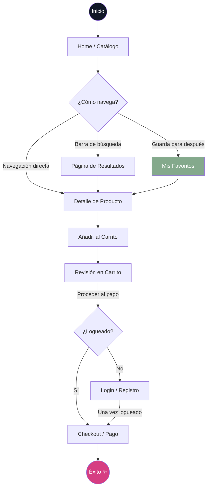
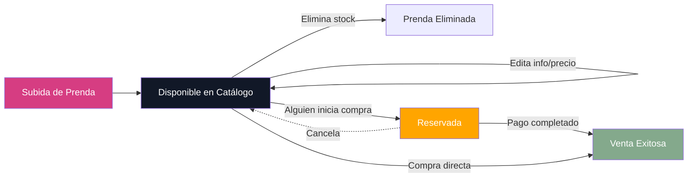
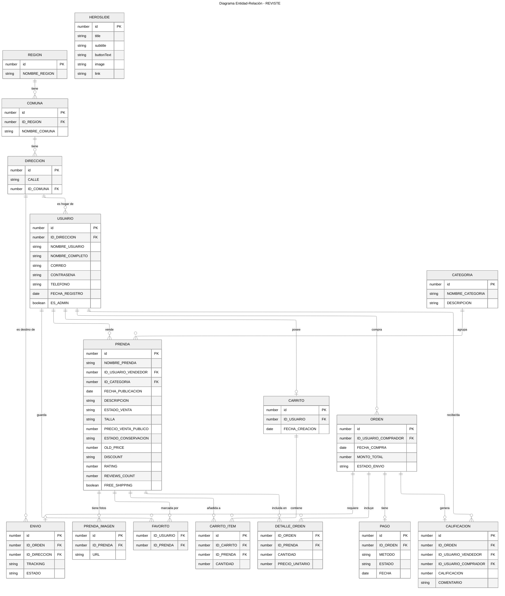

# REVISTE - Marketplace de Moda Circular 👗♻️


**REVISTE** es una plataforma premium de compra y venta de moda circular, diseñada para transformar la manera en que consumimos ropa y accesorios. Fusionamos una estética **Y2K/Glassmorphism** de vanguardia con la funcionalidad robusta de los grandes marketplaces globales, construida sobre un stack moderno de React y Tailwind CSS.

---

## ✨ Características Principales

### 📱 Arquitectura Mobile-First & Premium UI
- **Navegación Inteligente**: Sistema dual con barra superior minimalista para escritorio y **Fixed Bottom Nav** ergonómico para móviles.
- **Micro-interacciones**: Animaciones fluidas, efectos de glassmorphism y hover states dinámicos.
- **Sticky CTA**: Barra de compra persistente en móviles para agilizar la conversión.
- **Componentes CVA**: Sistema de diseño basado en átomos reutilizables con variantes controladas (Class Variance Authority).
- **Gestión de Stock**: Panel dedicado para vendedores con capacidades completas de CRUD (Crear, Editar, Eliminar).
- **Control de Acceso**: Funcionalidades de favoritos y gestión de tienda protegidas mediante sistema de autenticación.

### 🔍 Buscador Híbrido Inteligente (Atlas Search)
- **Fuzzy Search & Stemming**: Integración directa con MongoDB Atlas Search (usando `lucene.spanish`) que comprende plurales, ignora errores ortográficos (maxEdits) y no depende de acentos (ej. "sueter" encuentra "suéter").
- **Fusión Local/Servidor**: El frontend cruza la información en tiempo real, permitiendo buscar etiquetas dinámicas calculadas al vuelo (como "Oferta" o "Nuevo") al mismo tiempo que aprovecha la inteligencia de Atlas para el catálogo pesado.
- **Debounce Optimizado**: Búsqueda asíncrona fluida sin saturar la API.

### 🏗️ Arquitectura de "Vertical Slices"
El proyecto utiliza una estructura orientada a funcionalidades (**Feature-driven architecture**), eliminando el código espagueti y facilitando la escalabilidad:
- **Features aisladas**: Cada funcionalidad (Carrito, Catálogo, Admin) contiene sus propios componentes, hooks y lógica.
- **Layout System**: Jerarquía de layouts especializados (`MainLayout`, `AuthLayout`, `AdminLayout`) para manejar diferentes contextos de usuario.
- **Zustand State**: Gestión de estado global ligera y eficiente para el carrito de compras.

---

## 🛍️ Flujo de Compra (Customer Journey)

A continuación se describe el proceso optimizado que sigue un cliente desde el descubrimiento hasta la conversión:



## ♻️ Ciclo de Vida de la Prenda

Cualquier usuario puede participar en la economía circular de REVISTE siguiendo este flujo de gestión:



## 🗄️ Esquema de Base de Datos (ERD)

A continuación se detalla la estructura de datos real de Reviste, basada en los modelos de MongoDB (`server/models.ts`):



## 🛠️ Stack Tecnológico y Dependencias

### 🎨 Frontend & Interfaz
- **Core**: [React 18](https://reactjs.org/) + [React Router v6](https://reactrouter.com/) para navegación.
- **Estilos**: [Tailwind CSS](https://tailwindcss.com/) (Styling utilitario).
- **Componentes Base**: [@radix-ui](https://www.radix-ui.com/) para primitivas accesibles (Modales, Acordeones, Menús).
- **Herramientas de UI**: [CVA](https://cva.style/), `clsx` y `tailwind-merge` para gestión dinámica de clases y variantes.
- **Iconografía**: [Lucide React](https://lucide.dev/).
- **Notificaciones**: [Sonner](https://sonner.emilkowal.ski/) para popups (toasts) elegantes.
- **Estado Global**: [Zustand](https://docs.pmnd.rs/zustand/getting-started/introduction) para carritos y sesiones.

### ⚙️ Backend & Base de Datos
- **Servidor**: [Express.js](https://expressjs.com/) para la API REST, con soporte [CORS](https://expressjs.com/en/resources/middleware/cors.html).
- **Base de Datos**: [MongoDB](https://www.mongodb.com/) (Driver Nativo).
- **ODM**: [Mongoose](https://mongoosejs.com/) para modelado y esquemas de datos.

### 🛠️ Herramientas de Desarrollo
- **Lenguaje**: [TypeScript](https://www.typescriptlang.org/) (Tipado fuerte en todo el stack).
- **Empaquetador**: [Vite](https://vitejs.dev/) para tiempos de carga y construcción ultrarrápidos.
- **Ejecución de Servidor**: `tsx` y `concurrently` para correr el backend y el frontend simultáneamente en desarrollo.
- **Calidad de Código**: `eslint` y sus plugins para mantener buenas prácticas.
- **Variables de Entorno**: `dotenv` para configuración segura.

---

## 🚀 API Reference

El backend de REVISTE expone los siguientes endpoints para el manejo del catálogo y transacciones:

### Catálogo
- `GET /api/catalog/categories`: Obtiene la lista de nombres de categorías.
- `GET /api/catalog/products`: Obtiene todos los productos con sus imágenes y vendedores vinculados.
- `GET /api/catalog/search?q=...`: Endpoint dedicado para búsqueda inteligente y difusa impulsado por MongoDB Atlas Search.
- `GET /api/catalog/products/:id`: Obtiene el detalle completo de una prenda específica.
- `POST /api/catalog/products`: Crea una nueva prenda vinculada al usuario logueado.
- `GET /api/catalog/products/seller/:sellerId`: Lista los productos de un vendedor específico.
- `PUT /api/catalog/products/:id`: Actualiza precio o detalles de una prenda existente.
- `DELETE /api/catalog/products/:id`: Elimina una prenda y sus imágenes del sistema.
- `GET /api/catalog/hero-slides`: Obtiene las diapositivas dinámicas para el carrusel de inicio.

---

## 👕 Gestión de Productos (Vendedores/Admin)

¿Dónde se añaden las prendas?
1. **Mi Tienda (Todos los Usuarios)**: Cualquier usuario autenticado tiene acceso a `/my-store`, donde puede visualizar sus prendas activas, ajustar precios y editar detalles técnicos en una página dedicada.
2. **Subida Directa**: A través del icono de tienda o vía `/upload`, se accede al formulario de curatoria para publicar nuevos tesoros.
3. **Panel Admin (Administradores)**: Los administradores mantienen un control global en `/admin` para moderar el contenido de toda la plataforma.

### Control de Identidad y Negocio
La arquitectura separa estrictamente la cuenta del usuario de la actividad comercial:
- **Settings**: Gestión de perfil, seguridad y pagos (con navegación horizontal optimizada para móviles).
- **My Store**: Dashboard de ventas y control de inventario.
- **Global Logout**: Acceso inmediato al cierre de sesión desde la barra principal.

---

## 📁 Estructura del Proyecto

```text
src/
├── components/         # COMPONENTES GLOBALES (Átomos UI)
│   └── ui/             # Button, Input, Badge, Card (CVA)
├── layouts/            # ESTRUCTURAS DE PÁGINA
│   ├── MainLayout.tsx  # Marketplace convencional
│   ├── AuthLayout.tsx  # Foco en Login/Registro
│   └── AdminLayout.tsx # Dashboard administrativo
├── features/           # VERTICAL SLICES (El corazón de la app)
│   ├── catalog/        # Home, Detalle, Búsqueda, Hooks de datos
│   ├── cart/           # Lógica de carrito, Store, Ventana de compra
│   ├── auth/           # Login, Configuración de perfil
│   └── inventory/      # Panel admin, Mis prendas, Subida de productos
├── data/               # MockData y configuraciones persistentes
├── lib/                # Utilidades y configuración de Tailwind Merge
└── App.tsx             # Enrutamiento centralizado y lazy loading
```

---

## 🎨 Design System

- **Colores Brand**: 
  - `Brand Pink`: `#D63D82` (Primario)
  - `Eco Green`: `#84A98C` (Sustentabilidad)
  - `Brand Dark`: `#111827` (Estratificación)
- **Tipografía**: Outfit (Modernidad) & Playfair Display (Elegancia)
- **Estética**: Corner radius adaptativo (`32px`), sombras suaves y `backdrop-blur` para el efecto cristal.

---

## 🚀 Cómo empezar

1.  **Clonar y configurar**:
    ```bash
    git clone https://github.com/usuario/reviste.git
    cd reviste
    npm install
    ```

2.  **Desarrollo**:
    ```bash
    npm run dev
    ```

3.  **Compilación**:
    ```bash
    npm run build
    ```

> "El futuro de la moda es circular." - **REVISTE SpA 2026**
